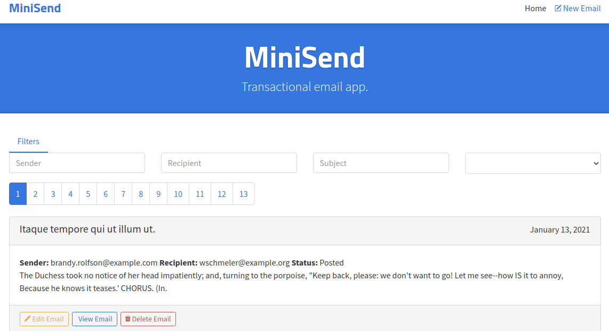

# 

> Vue.js codebase containing MiniSend REST APP (CRUD, advanced patterns, etc) that adheres to the [MiniSend](https://github.com/developer2700/minisend) spec and API.

Project demo is available at https://minisend.mtcdevserver4.com/

This codebase was created to demonstrate a fully fledged fullstack application built with **Vue.js** including CRUD operations, authentication, routing, pagination, and more.

## Getting started

Before contributing please read the following:

1. [Minisend API guidelines](https://github.com/developer2700/minisend)

```bash
# install editorconfig globally
> npm install -g editorconfig
```

The stack is built using [vue-cli webpack](https://github.com/vuejs-templates/webpack) so to get started all you have to do is:

``` bash
# install dependencies
> npm install
# serve with hot reload at localhost:8080
> npm run serve
```

Other commands available are:

``` bash
# build for production with minification
npm run build
```

## To know

Current arbitrary choices are:

- Vuex modules for store
- Vue-axios for ajax requests
- 'rwv' as prefix for components
